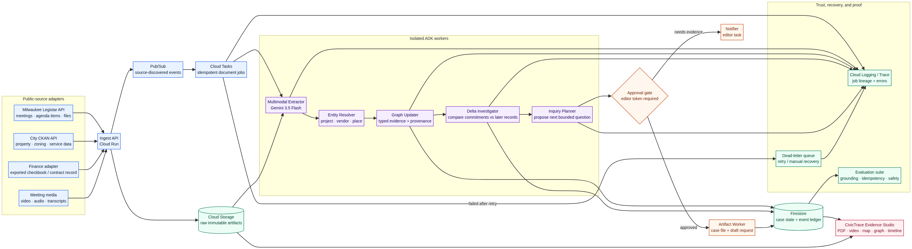
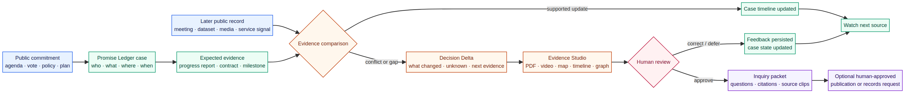

# CivicTrace

> **CivicTrace turns a public promise into a living, evidence-linked case file — and wakes up when the public record changes.**

CivicTrace is an approval-gated, public-evidence system for local accountability. It follows an official public commitment (a vote, a budget line, a project promise) through the later public records that touch it, anchors every fact to an exact page of an original document, says plainly what changed and what is still unknown, and prepares a human-reviewable inquiry packet. It never accuses, never publishes on its own, and never contacts anyone.

Built for the **All Things Agentic Hackathon** (Taskmaster category) by [Tarik Moody](https://github.com/tmoody1973). Python + Google ADK + Gemini Flash on Vertex AI; Next.js Evidence Studio; Google Cloud deployment planned in Slice 5. MIT licensed.

---

## Contents

1. [The problem](#1-the-problem)
2. [What CivicTrace does](#2-what-civictrace-does)
3. [Who it is for](#3-who-it-is-for)
4. [Product scope and release plan](#4-product-scope-and-release-plan)
5. [Non-negotiable product rules](#5-non-negotiable-product-rules)
6. [How it works](#6-how-it-works)
7. [The first case: TID 121, Bronzeville](#7-the-first-case-tid-121-bronzeville)
8. [Build status](#8-build-status)
9. [Run it locally](#9-run-it-locally)
10. [Repository map](#10-repository-map)
11. [Tech stack](#11-tech-stack)
12. [Documentation](#12-documentation)
13. [License](#13-license)

---

## 1. The problem

Local newsrooms and civic watchdogs have lost the capacity to do the slow part of accountability: remembering what a public body promised, noticing when a later record quietly changes it, and assembling the evidence before anyone asks a question. Agendas, amendments, annual reports and meeting video pile up faster than a shrinking newsroom can read them. Generic AI chat tools make this worse: they summarise confidently, cite loosely, and cannot be trusted to say "the record does not establish that."

## 2. What CivicTrace does

CivicTrace keeps a **Promise Ledger**: a durable, source-linked memory of public commitments. For each commitment it:

1. **Preserves the original record.** Every public document is stored as an immutable copy with its URL, retrieval time and SHA-256 fingerprint before anything reads it.
2. **Extracts anchored evidence.** A bounded AI agent proposes evidence excerpts; deterministic code validates them. Each accepted excerpt carries a verbatim quote, a neutral statement, and an exact anchor (PDF page, table cell, dataset row, or media timestamp).
3. **Detects change.** When a later record arrives, a Delta Investigator compares it to the original commitment and proposes a **Decision Delta**: what the public record establishes, what it does not, what is still unknown, and the exact next record that would resolve the gap.
4. **Reviews itself.** A second, independent Quality/Safety Reviewer checks every delta for missing anchors, causal or accusatory language, and policy flags. Only an approved delta with zero blocking issues is staged; everything else goes to a human.
5. **Shows its work.** The **Evidence Studio** lets a reviewer see the case state in words, read the quote beside the statement, jump from any anchor to the real page of the real document, and follow the whole audit trail (the **Evidence Trace**) — never a model's hidden reasoning.
6. **Stops at the human.** An inquiry packet (research summary, draft source question, records-request outline) is drafted only. A human must approve the exact artifact with a time-limited, case-bound approval token before anything could leave the system. The system itself never sends, files, or publishes.

The output is not an article, a verdict or a score. It is a **verifiable gap made visible**, with the chain of evidence intact and the next question ready.

## 3. Who it is for

| Persona | What they need | What CivicTrace gives them |
|---|---|---|
| Local reporter | Find consequential changes without re-reading every agenda | Source-grounded case, evidence clips, ready-to-review inquiry packet |
| Editor / investigations lead | Decide whether a lead is verified, material, and worth assigning | Decision Delta with provenance, explicit uncertainty, approval-controlled next action |
| Civic documenter / nonprofit researcher | Turn observation into durable, connected public knowledge | A transparent case ledger and bounded research workflow |
| Community reader | Understand what changed in their neighbourhood, school or project | Human-approved brief with source links, timeline and uncertainty labels |
| MPS transparency stakeholder | Follow public school-board commitments without exposing students | MPS Promise Ledger on public institutional evidence only |

## 4. Product scope and release plan

| Release | Objective | Included | Explicitly excluded |
|---|---|---|---|
| **Hackathon MVP — Milwaukee City Promise Ledger** (now) | Prove the complete source-to-inquiry loop on one real historical case, reproducibly, in the cloud | Legistar source replay; immutable artifact vault; anchored extraction with validation; Decision Delta + Quality Reviewer; Evidence Studio; human approval token + inquiry packet; Cloud Run/Firestore/GCS/Pub-Sub/Tasks deployment with IaC and teardown; duplicate-event and missing-record tests | Citywide live monitoring; autonomous outreach; allegation scoring; every City/County system |
| **MPS extension** | Second institutional adapter: public education accountability | MPS Board agenda/meeting-media adapter; Speech-to-Text batch transcription; public plan / aggregate report-card links; staged MPS brief | Any student-level data; attendance/discipline prediction; dynamic procurement scraping |
| **Pilot product** | Support one newsroom or civic partner across a beat | Scheduled source monitoring; editor inbox; reusable watch lists; adapter configuration; publish-to-draft workflow | Unsupervised publication; multi-tenant marketplace |
| **Platform expansion** | More jurisdictions and domain packs | County adapters; procurement/export connectors; city/school source templates; civic extraction evaluations; partner integrations | One generalised model expected to reason perfectly across all jurisdictions |

The MVP is built as **six vertical slices**, each a whole working piece, never a thinner product ([decision 003](docs/decisions/003-full-mvp-in-six-slices.md)):

1. Evidence spine — source policy, vault, idempotency, extraction boundary, replay, trace API ✅
2. Real agent + Decision Delta + Quality Reviewer (local) — delta ✅ · reviewer ✅ · trace/API ✅ · GCP dev project ✅ · real Gemini Flash agent ⏳
3. Evidence Studio UI (local) — shell, file endpoint, case card, Evidence Trace, PDF anchor jump, Playwright/axe gate + CI ✅
4. Human approval token + inquiry packet + failed-approval demo
5. Cloud deployment (Cloud Run, Firestore, GCS, Pub/Sub, Cloud Tasks, BigQuery), IaC, trace lineage, teardown
6. Meeting media (Speech-to-Text V2 + Media Evidence Agent)

**Non-goals, permanently:** inferring causality between policy and outcome; publishing allegations; scoring officials or institutions for integrity; any student-level data; sending messages or filing requests without approval; promising universal coverage of a municipality.

## 5. Non-negotiable product rules

These are failure modes we refuse to ship, and each is enforced in code and tests, not only in prose ([CLAUDE.md](CLAUDE.md), [privacy & evidence rules](.claude/rules/privacy-and-evidence.md)).

1. **Evidence before prose.** Every material claim has an original artifact id and a precise anchor.
2. **Unknown stays unknown.** `UNKNOWN`, `NOT_PUBLISHED`, `CONFLICTING`, `CANDIDATE_LINK`, `REQUEST_NEEDED`, `HUMAN_REVIEW` are first-class states, never filled by inference.
3. **Models propose; code validates.** An LLM cannot mutate a case, grant approval, trigger a side effect, or write a user-visible conclusion without deterministic validation.
4. **No unsupported allegations.** A single allegation-word list lives in the backend policy; the UI's entire vocabulary is tested against it.
5. **MPS privacy boundary.** No individual student data is ever ingested, indexed, inferred, logged, displayed or exported.
6. **No autonomous external action.** A human approves the exact case-bound artifact; approval expires and is audited; the worker fails closed.
7. **Direct official sources are authoritative.** Third-party research can produce only a candidate URL; CivicTrace retrieves and preserves the canonical source itself.
8. **No hidden source expansion.** New sources need an explicit allowlist change, fixture and test.
9. **Cost and security by design.** Gemini Flash by default; Cloud Run scales to zero with finite caps; secrets in Secret Manager; the browser never holds an AI key.

## 6. How it works



The orchestrator is deterministic application code, not an LLM super-agent. It owns routing, retries, validation, ledger writes and approvals.

```text
approved source event → raw artifact vault → deterministic route
  → bounded ADK evidence agent → schema / provenance / privacy validation
  → entity + case proposal → deterministic ledger update
  → Delta Investigator → Quality/Safety Reviewer → staged case
  → human approval → Inquiry Planner / Brief Builder → draft-packet renderer
```

Key design choices (plain English):

- **Append-only ledger.** Every step writes one immutable event (`ARTIFACT_STORED`, `EVIDENCE_ACCEPTED`, `ARTIFACT_NOT_PUBLISHED`, `DELTA_PROPOSED`, `DELTA_STAGED`, `CASE_HUMAN_REVIEW`, …). The UI renders only these validated events, so the Evidence Trace is an audit trail, not a reasoning transcript.
- **Idempotency key** = source version + artifact hash + job type + agent version + case scope, persisted before any side effect. Re-delivering an event leaves exactly one evidence item.
- **Frozen case bundle.** The Delta Investigator sees only the evidence for its own case, never the corpus.
- **Same seam, fake first.** All agents run behind one `StructuredAgentRunner` interface. A fixture-backed fake runner is the default so CI needs no credentials; the real Gemini Flash runner is swapped in behind the same seam and judged against hand-written fixtures.
- **Exact copies are checkable.** The PDF endpoint re-hashes the vaulted bytes on every read and returns the hash in a header; the UI can prove "this is the exact document we saved."



## 7. The first case: TID 121, Bronzeville

The reviewed replay corpus is real: three City of Milwaukee Legistar PDFs for **Tax Incremental District No. 121 (Bronzeville Arts & Tech Hub)**, plus one expected-but-absent record.

| Record | Anchor | What it says |
|---|---|---|
| 2024 Project Plan (file 240382) | p. 5, Table A | TOTAL Capital Project Costs **$700,000**, up-to amount |
| 2024 Annual TID Report (file 250623) | p. 163–164 | Authorized $763,750; Grant to Developer $700,000; completion status blank → `UNKNOWN` |
| Amendment No. 1, 2026 (file 260433) | p. 3 | City shall fund an estimated **$2,345,000**; adds up-to $1,645,000 developer grant |
| 2025 Annual TID Report | — | Not in Legistar as of 2026-08-19 → `NOT_PUBLISHED` (the honest empty slot) |

One local command replays the corpus and ends with:

> `DELTA_STAGED (REVISED) reviewer=APPROVE — 2024 plan $700,000 (p.5) → Amendment No. 1 $2,345,000 (p.3); next record: 2025 Annual TID Report.`

The delta says "the later document revises the City's stated contribution; the record supplied does not state why." It does not say why. That restraint is the product.

## 8. Build status

| Area | State | Proof |
|---|---|---|
| Source policy, allowlist, corpus manifest, fixture integrity | ✅ | `backend/tests/unit/test_source_policy.py`, `docs/sources/` |
| Immutable artifact vault (local) | ✅ | `test_artifact_vault.py` — refuses to overwrite changed bytes |
| Idempotent jobs, duplicate suppression | ✅ | `test_idempotency.py`, `test_workflow_duplicate.py` |
| Extraction boundary (agent proposes, validators accept/refuse) | ✅ | `test_extraction_boundary.py`, allegation-word policy |
| Decision Delta + validators + ledger states | ✅ | `test_delta_flow.py` |
| Quality/Safety Reviewer, staging rule | ✅ | `test_review_flow.py` |
| Read API: case summary, trace, case list, exact artifact bytes | ✅ | `test_replay_and_trace.py`, `test_case_list_and_artifact_file.py`; [contract](docs/implementation/api-contract.md) |
| Evidence Studio: shell, Promise Card, Decision Delta, Evidence Trace | ✅ | `docs/hackathon/proof/*.png`, 18 Vitest tests, axe clean |
| GCP dev project + Vertex AI + budget alert | ✅ | [runbook](docs/runbooks/local-vertex-setup.md) |
| Real Gemini Flash agent behind the same seam + grounding eval | ⏳ | Slice 2 |
| PDF pane with anchor jump + hash check | ✅ | `docs/hackathon/proof/moo-699-*.png` |
| Playwright smoke + axe gate + GitHub Actions CI | ✅ | [CI](https://github.com/tmoody1973/civictrace/actions) green; `frontend/e2e/` |
| Approval token, inquiry packet, failed-approval demo | ⏳ | Slice 4 |
| Cloud Run / Firestore / GCS / Pub-Sub / Tasks / BigQuery, IaC, teardown | ⏳ | Slice 5 |
| Meeting media (Speech-to-Text V2, Media Evidence Agent) | ⏳ | Slice 6 |

Backend: 129 tests, ruff + mypy clean. Frontend: 29 unit tests + 3 Playwright e2e (axe inside), TypeScript strict, ESLint clean. CI runs all of it on every push. Every closed issue in Linear carries a verification comment with real output.

## 9. Run it locally

Prerequisites: Python ≥ 3.12 with [`uv`](https://docs.astral.sh/uv/), Node 20+ with `pnpm`. No cloud account is needed for the replay or the UI; the fake agent runner is the default.

```bash
git clone https://github.com/tmoody1973/civictrace.git && cd civictrace

# 1. Backend: replay the reviewed TID 121 corpus (prints one line per ledger event, exit 0 when clean)
cd backend && uv sync
uv run python scripts/replay_corpus.py ../docs/sources/corpus-manifest.yaml \
    --replay-duplicate --out /tmp/civictrace-ledger.json

# 2. Serve the ledger
CIVICTRACE_LEDGER_JSON=/tmp/civictrace-ledger.json uv run uvicorn app.main:app --port 8000
curl -s localhost:8000/cases | jq '.data[].state'                      # "DELTA_STAGED"
curl -sI localhost:8000/artifacts/tid121-project-plan-2024/file         # exact PDF bytes + SHA-256 header

# 3. Evidence Studio (new terminal)
cd frontend && cp .env.example .env.local && pnpm install && pnpm dev
open http://localhost:3000/cases/case-tid121-bronzeville-arts-tech-hub

# Tests
cd backend  && uv run pytest -q && uv run ruff check . && uv run mypy app
cd frontend && pnpm lint && pnpm typecheck && pnpm test
```

To call the real Gemini Flash model locally, follow [`docs/runbooks/local-vertex-setup.md`](docs/runbooks/local-vertex-setup.md) (your own Google Cloud project, Application Default Credentials, $10 budget alert; no key files). Until Slice 2.2 lands, the fake runner remains the default.

## 10. Repository map

```text
civictrace/
├── backend/                 Python + FastAPI + (ADK seam). app/{schemas,domain,policies,services,orchestration,agents,api}
│   ├── scripts/replay_corpus.py      one-command corpus replay → ledger.json
│   └── tests/fixtures/…demo-v1/      reviewed public Legistar PDFs, extraction/delta/review fixtures, provenance
├── frontend/                Next.js 16 Evidence Studio: src/{app,components,features/{case,trace},lib}
├── infra/                   Terraform (Slice 5) + IaC guardrails
├── docs/
│   ├── product/PRD.md       full product requirements (problem, users, scope, journeys, data model, UX, MPS, metrics)
│   ├── architecture/        multi-agent design + prompts, Google stack decision, diagrams
│   ├── implementation/      api-contract.md, reasoning-visibility-ux.md, project structure
│   ├── decisions/           plain-English decision log (what we chose, what we gave up)
│   ├── runbooks/            local Vertex setup, cost/security, deploy, teardown
│   ├── sources/             source allowlist + corpus manifest
│   ├── hackathon/           requirements, prize blueprint, demo plan, proof screenshots
│   └── research/            Milwaukee go/no-go, MPS monitor and privacy boundary
├── CLAUDE.md                operating contract for AI coding sessions (rules, read-before-change, definition of done)
└── CONTEXT.md               shared vocabulary: Artifact, Anchor, Evidence, Promise Ledger, Decision Delta, Evidence Trace…
```

## 11. Tech stack

| Concern | Choice |
|---|---|
| Agent backend | Python 3.12+, Google ADK (bounded, read-only tools; typed proposals only) |
| Inference | Gemini Flash through Vertex AI (`gemini-3.7-flash`, location `global` — Gemini 3.x is served only from `global`); fake fixture runner by default |
| API | FastAPI, Pydantic v2 contracts independent of cloud SDKs |
| Durable state (Slice 5) | Firestore (cases, jobs, approvals, ledger events); Cloud Storage (immutable artifacts); BigQuery (structured corpus filtering) |
| Async work (Slice 5) | Pub/Sub fan-out, Cloud Tasks with idempotency keys and finite retries; Cloud Run API + IAM-only worker, min instances 0 |
| Meeting media (Slice 6) | Cloud Speech-to-Text V2 batch + Media Evidence Agent |
| UI | Next.js 16 / React 19 / TypeScript, shadcn/ui + Kibo UI, TanStack Query, AI SDK Elements `ChainOfThought` as the Evidence Trace, react-pdf |
| Quality | pytest, ruff, mypy; Vitest + Testing Library, axe-core; Playwright (Slice 3.6) |

Not in the MVP without a documented decision: a second UI framework, a vector database, an always-on cluster, TinyFish/Parallel, Antigravity SDK, Genkit.

## 12. Documentation

Start with [`docs/README.md`](docs/README.md). Highlights:

- [Product Requirements Document](docs/product/PRD.md) — the full product, all releases
- [Multi-agent design and prompts](docs/architecture/multi-agent-design-and-prompts.md) · [Google stack decision](docs/architecture/google-agent-stack-decision.md)
- [API contract](docs/implementation/api-contract.md) · [Reasoning-visibility UX](docs/implementation/reasoning-visibility-ux.md)
- [Decision log](docs/decisions/) — 001 where work is tracked · 002 first case is a TIF promise · 003 full MVP in six slices
- [Hackathon requirements and demo plan](docs/hackathon/)
- Work tracking: Linear (team Moodyco, `MOO-*`); every closed issue has a verification comment with real output

## 13. License

MIT — see [LICENSE](LICENSE). The public records under `backend/tests/fixtures/` are City of Milwaukee Legistar documents and remain public records; see `docs/sources/` for the allowlist and corpus manifest.
